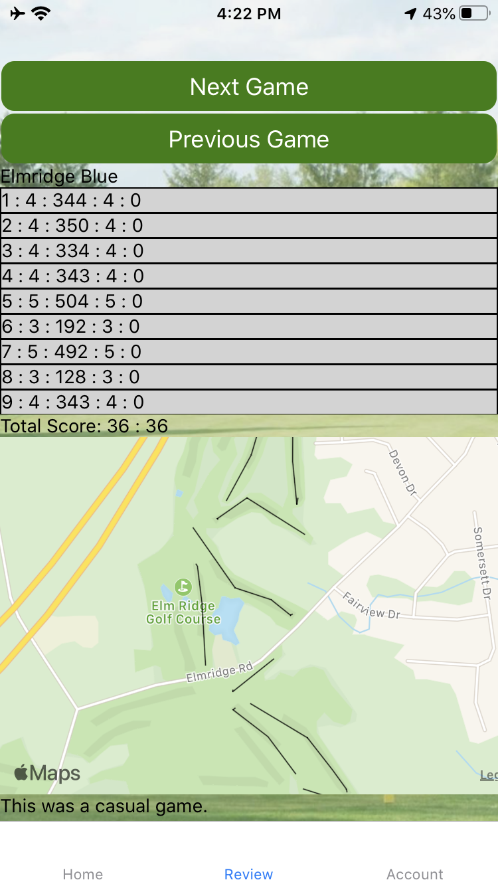

# Visual Scorecard

## Overview

Visual Scorecard is a golf scorecard app which tracks score and adds the position of each stroke to a map. Once the game is complete the user can look back on their past games using the review feature. Visual Scorecard utilizes React Native to interact with IOS and Andriod, a node server to handle authentication, and Airtable as the database. 

## Sign in & Sign up

When a user opens the app they can either log in or sign up. To login, a user must press the login button and enter their credentials, or press the demo login button. Once logged in their session is saved with a session token and their email in AsyncStorage. 

```javascript
const signin = (dispatch) => async ({ email, password }) => {
    try {
        const response = await axiosInstance.post('/signin', { email, password })
        let token = response.data.token
        await AsyncStorage.setItem('token', token);
        await AsyncStorage.setItem('visualScorecardUser', email);
        dispatch({ type: 'login', payload: {token, email} })
        navigate('Home')
    } catch (err) {
        dispatch({ type: 'add_error', payload: err.response.data })
    }
}
```

If a user wishes to create an account they must enter their email and a password. They are then logged in and a session token and their email is saved in AsyncStorage

```javascript
const signup = (dispatch) =>  async({email, password}) => {
    try {
        const response = await axiosInstance.post('/signup', {email, password})
        let token = response.data.token
        await AsyncStorage.setItem('token', token);
        await AsyncStorage.setItem('visualScorecardUser', email);
        dispatch({ type: 'login', payload: { token, email }})
        navigate('Home')
    } catch(err) {
        dispatch({ type: 'add_error', payload: err.response.data })
    }
}
```


## New Game & New Course

Once signed in a user may start a new game. They will be able to choose from any course that has already been played by clicking on that course, or they may create their own coures by clicking the Create New Course button. 


If they decide to create a new course, they will be prompted to enter the name of the course and the par and yards of each hole on the course. This new course will then be saved to Airtable for any player to play from. 


The par and yards information is stored using the useReducer hook. 

```javascript
const reducer = (state, action) => {
    Object.freeze(state)
    let currentState = Object.assign({}, state)
    switch (action.type) {
        case 'par': // updates par
            currentState.par[action.payload.hole] = action.payload.newPar
            return { ...state, par: currentState.par }
        case 'yards': // updates yards
            currentState.yards[action.payload.hole] = action.payload.newYards
            return { ...state, yards: currentState.yards }
        default:
            return state
    }
}
```

## Play

Once a player has selected or created a course they can start the game. Once again the useReducer hook is used to track information on the score, the current hole, and the GPS coordinates of each shot. 

```javascript
const reducer = (state, action) => {
    Object.freeze(state)
    let currentState = Object.assign({}, state)
    switch (action.type) {
        case 'makeStroke': // carries stroke actions
            currentState.score[state.hole] += 1

            return { ...state, score: currentState.score }
        case 'endHole': // does not update score or record a shot
            currentState.score[state.hole + 1] = 0
            currentState.shots[state.hole + 1] = []
            return { ...state, score: currentState.score, shots: currentState.shots , hole: state.hole + 1 }
        case 'finishGame':
            currentState.complete = true
            updateGameDetails({id: action.payload.gameId, fields: currentState})
            return { ...state, complete: true }
        case 'recordShot': // records a shot and updates the database
            currentState.shots[state.hole].push(action.payload.pos)
            updateGameDetails({ id: action.payload.gameId, fields: currentState })
            return { ...state, shots: currentState.shots}
        case 'seeState':
        default:
            return state
    }
}
```

Location is retrieved using navigator.geolocation function. 

```javascript
    navigator.geolocation.getCurrentPosition(
        pos => {
            dispatch({ type: 'recordShot', payload: {pos: pos, gameId: gameId} })
        }
    );
```

Once a hole is complete the user should press the "In" button which will prompt the user to confirm finishing the hole using an alert. If they confirm the hole will be incremented. 

```javascript
const confirmEndHole = (state, dispatch, props, gameId) => {
    Alert.alert(
        'End Hole?',
        'Would you like to end this hole?',
        [
            { text: 'yes', onPress: () => {
                if (state.hole === 9) {
                    dispatch({ type: 'finishGame', payload: { gameId: gameId } })
                    props.navigation.navigate('Review', { lastGame: state })
                } else {
                    dispatch({ type: 'endHole', payload: { gameId: gameId } })
                }
            }},
            {text: 'no', onPress: () => {}, style: 'cancel'}
        ]
    )

}
```




The current scores are displayed on the screen using a Scorecard component, and the map is rendered using a Map component. 


## Review

At any time a user can look back and review their previous games. AXIOS is used to fetch all completed games belonging to the user from Airtable. 

```javascript
export const getAllGames = async () => {
    const email = await AsyncStorage.getItem('visualScorecardUser')
    const res = await axiosAirtable.get(`/scores?filterByFormula=AND({complete}='true' {user}=${email})`)
    if (res.data.records.length > 0) {
        let results = res.data.records.map((record) => {return record.id})
        return results
    } else {
        return null
    }
}
```


Previous games are displayed using a Scorecard component and a Map component. 
